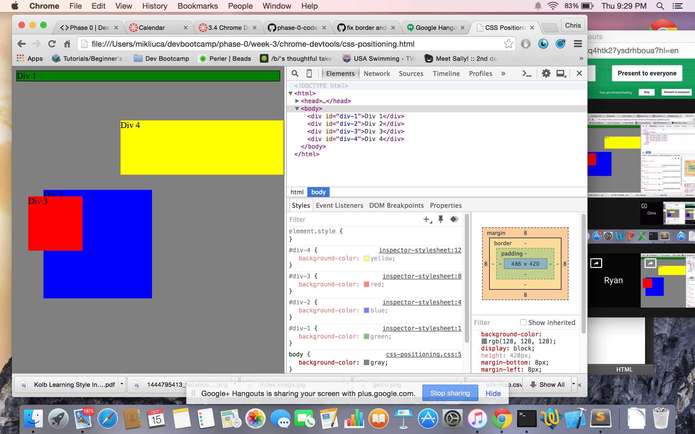
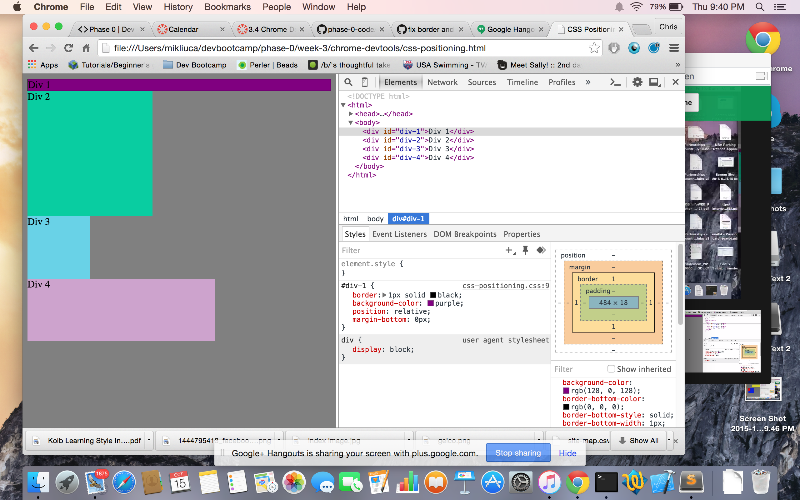
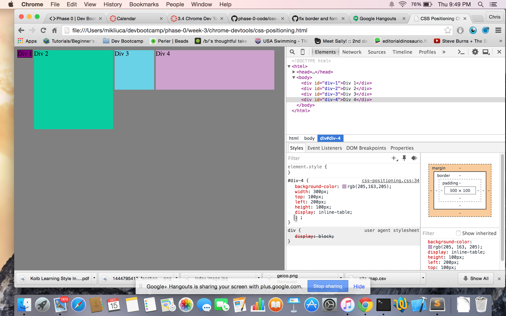
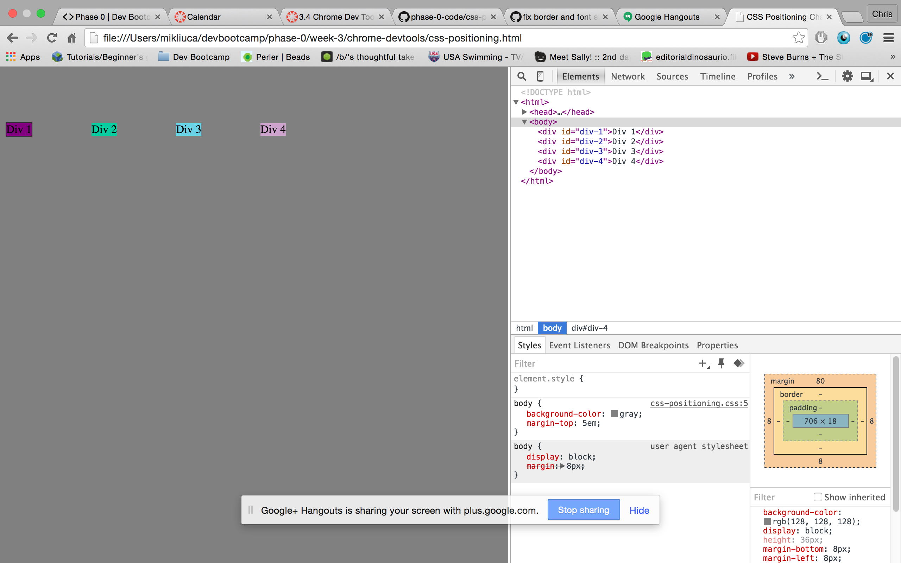
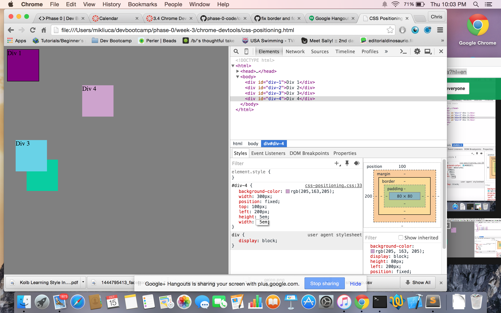
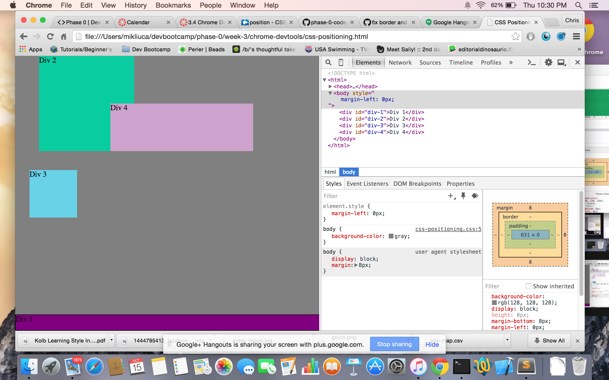
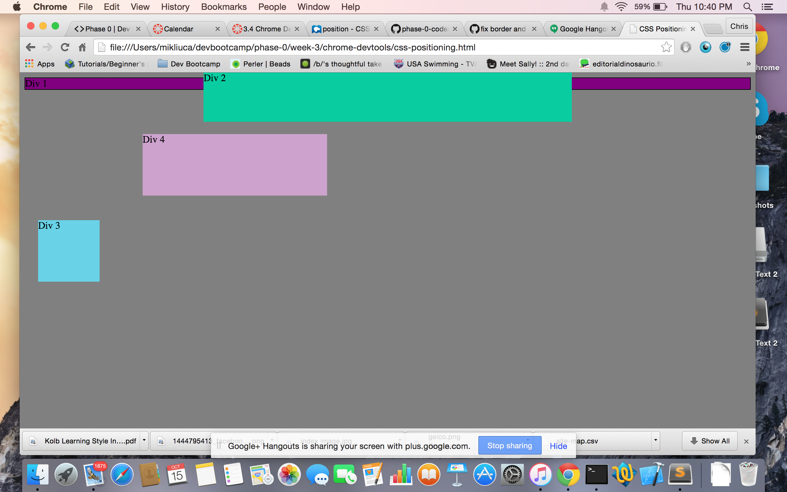
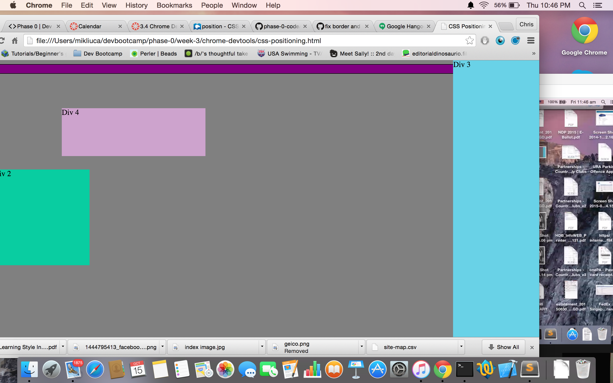
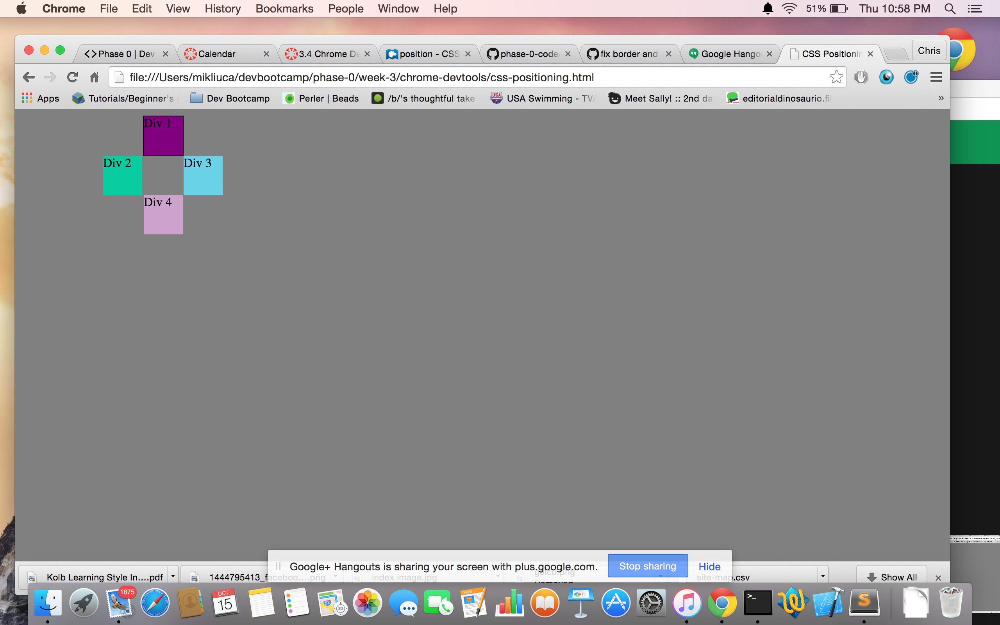

**How can you use Chrome's DevTools inspector to help you format or position elements?**

The inspector can help me to check the values for the margins and padding. The key thing is that I can see how the code looks in a browser window and adjust it accordingly. If I play around with the DevTools and find a set of margins that works better, I can then implement them into my code.

**How can you resize elements on the DOM using CSS?**

Elements can be resized by playing around with the width and height settings.

**What are the differences between Absolute, Fixed, Static, and Relative positioning? Which did you find easiest to use?
Which was most difficult?**

Fixed means the item in question will always stay at the given location, even if you scroll. That helps if you want something to stay at the bottom of your browser window or anywhere else. Absolute means the object is moved based on the closest object. Relative allows you to move elements without changing layout. Static does not let you use the z-index properties (right, left, top, bottom). The easiest one to use was fixed, which let you position the object in the same place regardless of browser window. The name fit the function, which is why it stuck easier. The most difficult to use were Absolute and Static, because their immediate use was not as clear to me during this exercise.

**What are the differences between Margin, Border, and Padding?**

Padding changes the space around a given object. Border adds an outline to a given object. Margin changes the location of the object relative the the dimensions of the space/browser window

**What was your impression of this challenge overall? (love, hate, and why?)**

The challenge was a bit tedious with regards to getting a few of the solutions to work, but I see it being a very useful tool later on. Getting familiar with the functions Chrome DevTools has will be beneficial.

