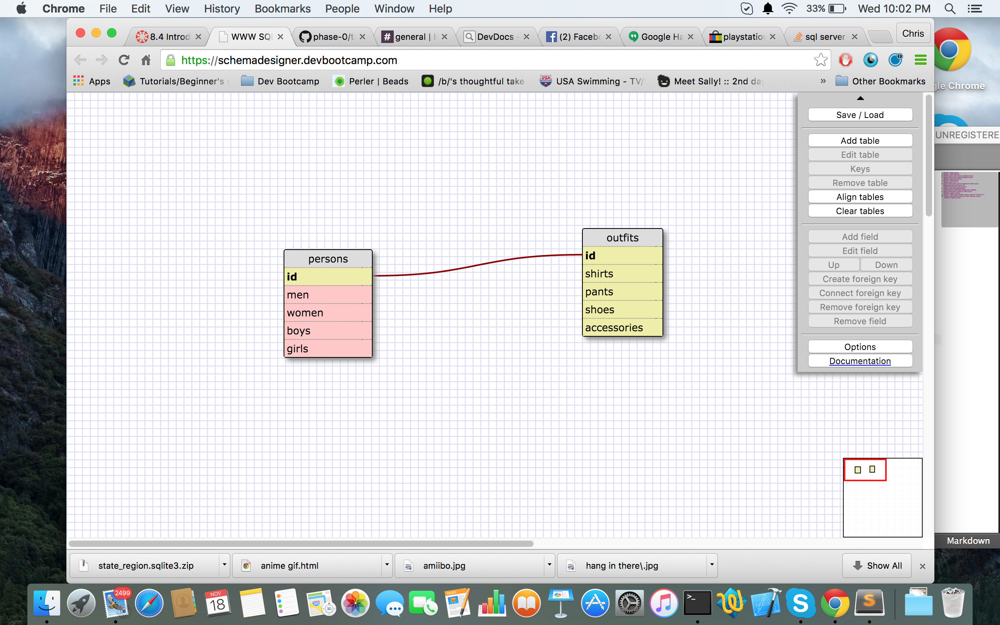

1. SELECT * FROM states;
2. SELECT * FROM regions;
3. SELECT state_name,population FROM states;
4. SELECT state_name,population FROM states
   ORDER BY population DESC;
5. SELECT * FROM states
   WHERE region_id='7';
6. SELECT state_name,population_density FROM states
   WHERE population_density > 50
   ORDER BY population_density ASC;
7. SELECT state_name FROM states
   WHERE population BETWEEN 1000000 AND 1500000;
8. SELECT state_name,region_id FROM states
   ORDER BY region_id ASC;
9. SELECT * FROM regions WHERE region_name LIKE "%Central";
10. SELECT region_name,state_name FROM regions,states
    ORDER BY region_id ASC;

**What are databases for?**

Databases are for storing data and identifying its characteristics.

**What is a one-to-many relationship?**

A one to many relationship is when one thing belongs a category that has many of the one thing within it. For example, a person lives in a state, and states have many people living in them.

**What is a primary key? What is a foreign key? How can you determine which is which?**

The primary key is a unique identifier for a table. A foreign key is when a field in one table identifies a row of another table. Usually the foreign key refers to the primary key. A primary key can be targeted by multiple foreign keys, or none at all.

**How can you select information out of a SQL database? What are some general guidelines for that?**

You can SELECT using the SELECT keyword identifying the column and which table it comes from. The general guidelines are to make sure to end with ; and also that select should be capital.
